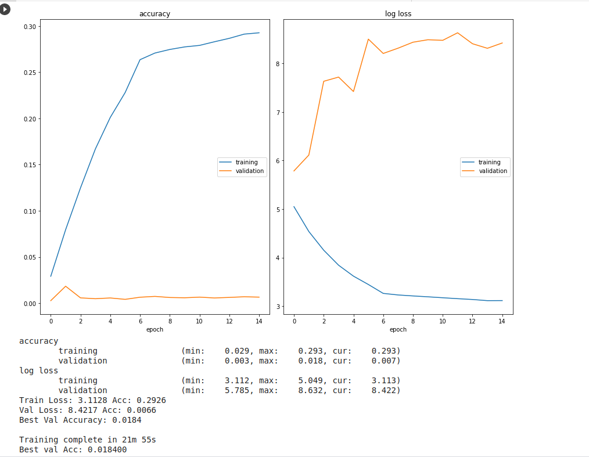
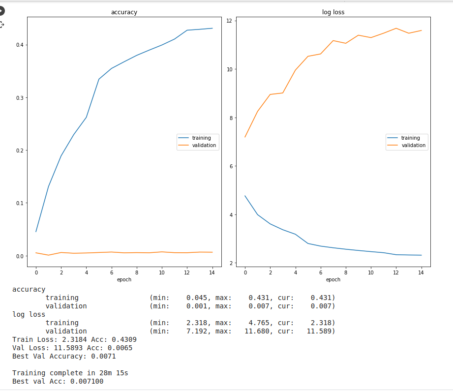
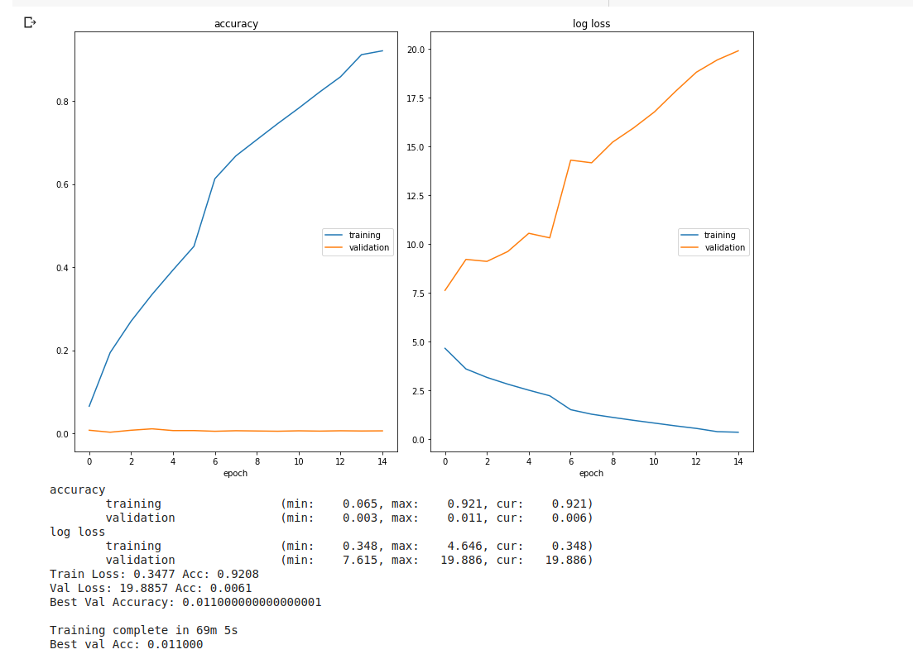
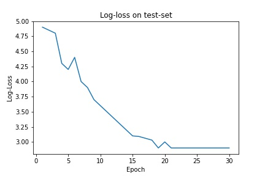

# Tiny-ImageNet-AlexNet:

* The given dataset over [here](https://drive.google.com/file/d/1h_J2ehtdpE_vqKawhGHy205pjPhvv5_p/view) is of tiny-imagenet created by professors at stanford.

* It's a miniversion of imagenet data having 200 labels. Here the goal was to train tiny imagenet data from scract on any model.

* I have trained the data on 4 different models, which are ResNet18, ShuffleNetV2, ResNet50, AlexNet. From these models AlexNet had higher training and validation accuracy

* Trained all these models on **GOOGLE COLAB** with gpu support.

### 1. ResNet18:

* **Preprocessing Applied:**

* Started out simple by not applying any preprocessing other than Random Horizhontal flip on train data.

```python
data_transforms = {
    'train': transforms.Compose([
        transforms.RandomHorizontalFlip(),
        transforms.ToTensor(),
    ]),
    'val': transforms.Compose([
        transforms.ToTensor(),
    ]),
}
```

* Trained this model for 15 epochs which generated the results as shown below.

<p align="center">
  
</p>

### 2. ShuffleNetV2:
* **Preprocessing Applied:**

* The mean and standard deviation is calculated for every channel seperately and the normalization is applied channel-wise.

```python
data_transforms = {
    'train': transforms.Compose([
        transforms.RandomHorizontalFlip(),
        transforms.ToTensor(),
        transforms.Normalize(mean=[0.485, 0.456, 0.406], std=[0.229, 0.224, 0.225])]),
    'val': transforms.Compose([
        transforms.ToTensor(),
        transforms.Normalize(mean=[0.485, 0.456, 0.406], std=[0.229, 0.224, 0.225])])
}
```

* Trained this model for 15 epochs which generated the results as shown below.

<p align="center">
  
</p>

### 3. ResNet50:

* **Preprocessing Applied:**

```python
data_transforms = {
    'train': transforms.Compose([
        transforms.RandomHorizontalFlip(),
        transforms.ToTensor(),
        transforms.Normalize(mean=[0.485, 0.456, 0.406], std=[0.229, 0.224, 0.225])]),
    'val': transforms.Compose([
        transforms.ToTensor(),
        transforms.Normalize(mean=[0.485, 0.456, 0.406], std=[0.229, 0.224, 0.225])])
}
```

* Trained this model for 50 epochs which generated the results as shown below.

<p align="center">
  
</p>

### 4. AlexNet:

* Found a github repo over [here](https://github.com/DennisHanyuanXu/Tiny-ImageNet) which had trained Alexnet on tiny imageNet and it had appealing results.

* Hence followed same steps as given in the repository [README](https://github.com/DennisHanyuanXu/Tiny-ImageNet/blob/master/README.md).

* **Preprocessing Applied:**

* Apply preprocessing mean estimated mean values of every channel.

```python
 norm = transforms.Normalize(mean=[0.5, 0.5, 0.5], std=[0.5, 0.5, 0.5])
train_trans = [transforms.RandomHorizontalFlip(), transforms.RandomResizedCrop(224), transforms.ToTensor()]
val_trans = [transforms.Resize(256), transforms.CenterCrop(224), transforms.ToTensor(), norm]
```

* Log Loss and Accuracy after training the model for 30 epochs.

<p align="center">
  
</p>

<p align="center">
  
</p>

* Average Miss Rates of from lower-5 to higher-5 while inferencing:


* Colab link for **all models except AlexNet**:[Link](https://colab.research.google.com/drive/1B-KikqF_P57KZ8WHRtbUWTNKTLhyNAOP?usp=sharing)

* Colab link for **AlexNet**:[Link](https://drive.google.com/file/d/1RvE-Jo0GnCl2z8_yc84YLp0Fpv9TtL3i/view?usp=sharing)


